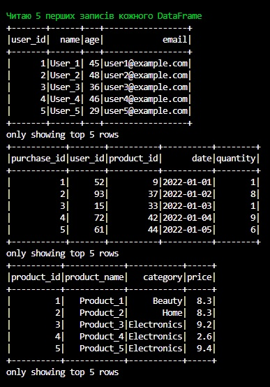
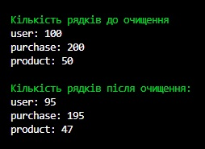
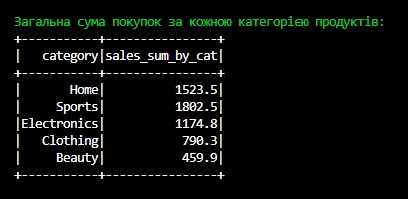
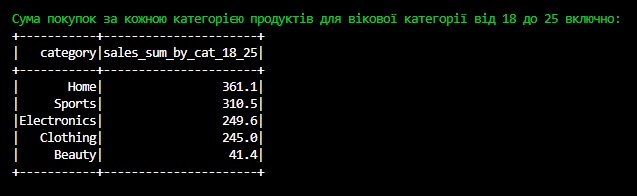
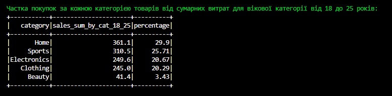
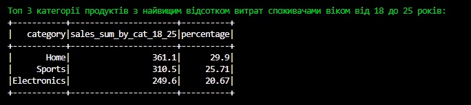

# goit-de-hw-03

1. Завантажте та прочитайте кожен CSV-файл як окремий DataFrame.

2. Очистіть дані, видаляючи будь-які рядки з пропущеними значеннями.

3. Визначте загальну суму покупок за кожною категорією продуктів.

4. Визначте суму покупок за кожною категорією продуктів для вікової категорії від 18 до 25 включно.

5. Визначте частку покупок за кожною категорією товарів від сумарних витрат для вікової категорії від 18 до 25 років.

6. Виберіть 3 категорії продуктів з найвищим відсотком витрат споживачами віком від 18 до 25 років.

